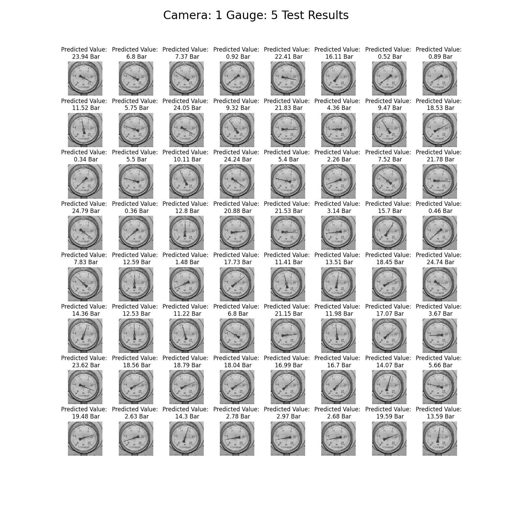

[](https://www.captain-eye.com/)
***
Analog Gauge Reading Using CNN Regression
=======================================
***A Deep Learning Approach for Automated Gauge Reading using CNN regression***
***
 

 
***
> **Authors:**
> - [Guy Dahan](https://github.com/Guydada)
***
> **Submission:**
> - Supervising company: [Captain's-Eye](https://www.captain-eye.com/)
> - Project Instructor: Mr. Doron Oizerovich
> - Project Supervisor: [Dr. Jonatan Ostrometzky](jonatano@tauex.tau.ac.il)
> - Faculty: [Engineering](https://en-engineering.tau.ac.il/)
> - Department: [Digital Sciences for Hi-Tech](https://en-engineering.tau.ac.il/BSc-in-Digital-Sciences-for-Hi-Tech)
> - [Tel-Aviv University](https://english.tau.ac.il/)
***


# Table of Contents

1. [Requirements](#Requirements)
2. [Installation](#installation)
3. [Usage](#Usage)
4. [Academic Report](#Report)

# Requirements

- Python 3.8
- PyTorch 1.10.2
- Torchvision 0.11.3
- Linux Ubuntu 20.04 LTS / 22.04 LTS / Windows 10 (Tested on all of them)

## Project Directory Structure

```
├───src
│   ├───calibrator
│   │   └───__pycache__
│   ├───gauges
│   │   └───__pycache__
│   ├───model
│   │   └───__pycache__
│   ├───utils
│   │   └───__pycache__
│   └───__pycache__
├───demo
├───__pycache__
├───docs
└───.readme_media
```

- `src` - Contains the source code of the project
    - calibrator - Contains the code for the Calibrator App
    - gauges - Contains the code for the Gauges classes
    - model - Contains the code for the CNN regression model
    - utils - Contains the code for the utility functions IE mathematical functions and image processing functions
- `docs` - Documentation and an academic [poster](docs/poster_gauge_Guy_Dahan.pdf) made for the project
- `README.md` - The current document, serving as the final report for this project
- `settings.toml` - The project's local settings file. When cloned this will generate the default settings.
- `config.py` - This file will generate environment specific settings for the project, including the generation of data
  directories and their respective paths.

___

# Installation

Two ways to install the package:

- Using Anaconda
- Using pip

Clone the repository, and run the following commands in the root directory of the repository:

## Using Poetry

```bash
$ poetry install
``` 

## Using Anaconda

```bash
$ conda create --name <env> --file requirements.txt
```

# Settings file

This project is designed to be a flexible project, which will support quick and easy deployment of the project
in different operating systems and scenarios. for that purpose, a settings file is created, which will generate
automatically the project's configuration. The available settings are:

| Setting                    | Default Value                | Effect                                                                                 |
|----------------------------|------------------------------|----------------------------------------------------------------------------------------|
| DEV                        | "False"                      | DEV mode - No error checking for UI                                                    |
| GAUGE_CALIBRATION_FILE_XML | gauge_params.xml'            | Name of the gauge calibration_data file                                                |
| TRAIN_IMAGE_NAME           | 'train_image.jpg'            | Name of the training image                                                             |
| NEEDLE_IMAGE_NAME          | 'needle_image.jpg'           | Name of the needle image                                                               |
| TRAIN_SET_DIR_NAME         | 'train_set'                  | Name of the training set directory                                                     |
| XML_FILE_NAME              | "camera_{}\_analog_gauge_{}" | Name of the gauge calibration_data file                                                |
| VALIDATION_SET_DIR_NAME    | 'validation_set'             | Name of the validation set directory                                                   |
| REPORT_PLT_NAME            | 'test_report.png'            | Name of the report plot                                                                |
| WINDOW_SIZE                | [1500, 1500]                 | Default Calibrator app window size (width, height)                                     |
| EDIT_IMAGE_SIZE            | [500, 500]                   | Default edit image window size (pixels)                                                |
| TRAIN_IMAGE_SIZE           | 64                           | Default train image size (pixels)                                                      |
| REPORT_PLT_SIZE            | 15                           | Default report plot size (inches)                                                      |
| LOSS_THRESHOLD             | 0.002                        | Threshold for the loss function                                                        |
| BATCH_SIZE                 | 64                           | Batch size for dataset loading and training                                            |
| BATCH_MULTIPLIER           | 3                            | Batch multiplier for building the dataset                                              |
| EPOCHS                     | 150                          | Number of epochs for training                                                          |
| LEARNING_RATE              | 0.001                        | Learning rate for the model                                                            |
| AUTO_ADD_EPOCHS            | "True"                       | Automatically add epochs to the model when training if the loss is below the threshold |
| TORCH_SEED                 | 147                          | Seed for the torch random number generator                                             |
| NUM_WORKERS                | 1                            | Number of workers for dataset loading                                                  |
| DEFAULT_MODEL_TYPE         | "best"                       | Default model type for loading (best or latest)                                        |
| MODEL_VERSION              | "1.0"                        | Model version for saving                                                               |
| GAUGE_TYPES                | ['analog', 'digital']        | List of gauge types supported by the app                                               |
| TEST_REPORT_IMAGE_TILE     | 8                            | Number of images in the test report image tile                                         |

# Usage

This application has three parts:

1. *Calibration* using UI - designed to be performed quickly and once only for each gauge
2. *Training* the CNN model specifically for the gauge using the automatically generated calibration data
3. *Reading* the gauge value using the trained CNN model


## Demo

> **_NOTE:_** This project was designed completely to fit Captain's-Eye requirements, so it does not have any need for a
> native CLI
> interface. The application will give some feedback using the terminal regarding errors and progress.

To perform calibration, a sample image is needed of gauge. Through this example I would walk you through the process
of calibration, training and reading from a gauge using the code and image sample provided in the `demo` folder.

### Calibrator App

Got to `demo` directory and run:

```bash 
$ python full_demo.py
```

The Calibrator App will open:


Click: `File` -> `Load Calibration Image`. A prompt will appear asking you to select the image. for this demo select the
demo
gauge in the `demo` folder.


The Calibrator App is intuitive and easy to use. It also includes a user error-checking system, which can be
disabled/enabled int the project's settings file using the `DEV` flag (set to `True` for no error checking).

The calibration steps show in red color on the left bar, indicating the which steps were not completed.
The order of steps is top to bottom. Completed steps are shown in green color.

| Step             | Effect                                                                      |
|------------------|-----------------------------------------------------------------------------|
| Crop             | Crop the image                                                              |
| Set Perspective  | Fix perspective issues                                                      |
| Circle Detection | Detect manually/automatically circles in the image to find the gauge center |
| Needle Detection | Using a brush, the user marks the needle for the gauge                      |
| Set Zero Angle   | Using the rotation bar, rotate to the center angle and mark it              |
| Set Min Angle    | Using the rotation bar, rotate to the minimal angle and mark it             |
| Set Max Angle    | Using the rotation bar, rotate to the max angle and mark it                 |
| Test Reading     | Test the reading from the angles                                            |

#### Crop

Simply click the `Crop` button to crop the image.


#### Set Perspective

Click the `Set Perspective` button to fix the perspective issues. Use either picking 4 points or manually tweaking
the perspective bars.


#### Circle Detection 
When clicked, the app will try to automatically detect the gauge center. If it fails (visually examined by the user)
Pick the center manually.


#### Needle Detection
Set the parameters for the gauge - max reading, min reading and units. Then simply draw the needle on the image.
The size of the brush can be changed using the 'line width' slider.


#### Set Zero Angle
Rotate the gauge to the center angle and mark it. this will change slightly from gauge to gauge and is used for 
calculating the reading the gauge later. 


#### Set Min Angle
Rotate the gauge to the minimal angle and mark it.


#### Set Max Angle
Rotate the gauge to the max angle and mark it.


#### Test Reading
Test the reading from the angles. The reading will be displayed in the bottom bar. Visually examine the reading to
make sure the calibration is correct.


> **_NOTE:_** If reading is not correct, it usually indicates that the perspective is not correct. Try to reset and
> re-calibrate the gauge.

### Synthetic Data

Synthetic data will be created automatically for the gauge. The synthetic data is created using the calibration data and
will be split into three sets:
- Training set
- Validation set
- Test set

The default split is determined by the batch size, and the default train size is 3 times the batch size. The validation
and test sets are each at the same size as the batch size.

The synthetic data can be found in the auto-generated `data/camera_{}/gauge_{}/` folder. where the `{}` represents 
indexes that are generated automatically when calibrating the gauge.

### Training, Validation and Testing

After calibration, the app will start training the model (when using the `full_demo.py` script). this can be also called 
manually as follows:

```python
import src.gauges.gauge as g

calibration = g.AnalogGauge.calibrate() 
analog_gauge = g.AnalogGauge(calibration) # calibration is a dictionary with the calibration data. can also be loaded from a file
analog_gauge.start() # start the training, validation and testing process for the gauge
```

The training process will take some time to complete. The app will display the progress in the terminal. Each epoch
will display the loss for train and validation data. 

#### Auto Add Epochs

The loss threshold is used to determine when to add more epochs to the model. If the loss is below the threshold. The 
default is 0.002. This can be disabled or edited in the project's settings file.

#### Training and Validation Report, Gauge Directory

When the training process is complete, a testing process will be performed. The testing process will test the
performance of the model on the test set and save a visual report of the results in the gauge's directory.

The gauge directory will contain the following files:
- `train` `validation` `test` - the training, validation and test sets containing the data for the model
- `gauge_net_v1.0_best.pt` - the trained model's weights specific to the gauge - best performing model
- `gauge_net_v1.0_last.pt` - the trained model's weights specific to the gauge - last epoch model
- `needle_image.png` - the needle image used for the gauge
- `train_image.png` - the image used for the training set generation
- `train_report.csv` - the training report detailing loss for each epoch of the training set
- `val_report.csv` - the validation report detailing loss for each epoch of the validation set
- `test_report.csv` - the test report detailing loss for each epoch of the test set
- `test_report.png` - a visual reference of the test set results, showing the reading for different angles
- `training_plots.png` - shows the loss for each epoch of the training set and the validation set
- Additional CSV files - containing the summary for each image used in each set, it's real angle in radians and angles,
and whether the image was augmented or not.

##### Training and Validation Report
The plot should show a converging trend for the loss. The loss should decrease as the epochs increase.


##### Test Visual Report
The plot should show the reading for each angle in the test set.


### Getting a Reading for a Calibrated Gauge

Finally, in order to get a reading for a calibrated gauge, all that is needed is the calibration's XML file. 
This allows the app to recreate the preprocessing needed for the model to get its readings quicly, and uses
the trained model to get the reading.

```python
import src.gauges.gauge as g

analog_gauge = g.AnalogGauge('camera_{}_analog_gauge_{}.xml').get_reading('image.png')
```
___

# Academic Report

## Abstract

### Coding Standards

I have taken a big effort to try and withstand the following:

- [PEP8](https://www.python.org/dev/peps/pep-0008/)
- OOP principles
- Documentation
- Simplicity
- Minimal code duplication using inheritance and composition
- Version control is done using [Git](https://git-scm.com/).

## Define the Problem

The problem we are trying to solve is to recommend articles to users based on their behavior and the articles they
have read and interacted with. This seemingly simple problem is actually a huge challenge in the field of
recommendation.
We think this dataset is especially interesting because it gives us the opportunity to explore both collaborative and
content based filtering approaches.

Additional challenges include:

- How to create the features?
- How much of the data is relevant?
- How to evaluate the results?


### Performance Metrics


The synthetic data is created using the following steps:

This is implemented using numPy's `linspace` function.

```mermaid
flowchart LR
```

### Model Architecture

### Performance Metrics

### Results

## Conclusions and Next Steps


## Footnotes

- <a name="footnote1">1</a>: While currently implemented fully for TF-IDF, we will be implementing it for hybrid
  approach.
- <a name="footnote2">2</a>: We use The word "vector" interchangeably, practically speaking, about csr-matrices.

## References

- [MIND](https://msnews.github.io/), by Microsoft
- [Microsoft Recommender Repository](https://github.com/microsoft/recommenders)
- Stevens, E., Antiga, L., & Viehmann, T. (2020).
  [Deep Learning With PyTorch](https://www.google.com/search?client=firefox-b-e&q=deep+learning+with+pytorch+). Manning
  Publications.
- Wu, F., Qiao, Y., Chen, J. H., Wu, C., Qi, T., Lian, J., ... & Zhou, M. (2020, July). [Mind:
  A large-scale dataset for news recommendation](https://aclanthology.org/2020.acl-main.331.pdf). In Proceedings of the
  58th Annual Meeting of the
  Association for Computational Linguistics (pp. 3597-3606).


