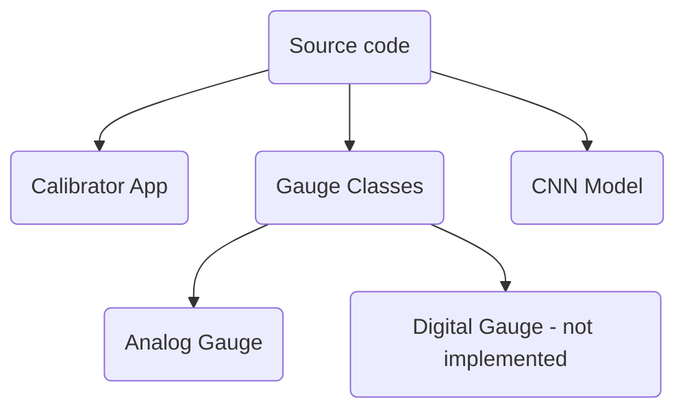
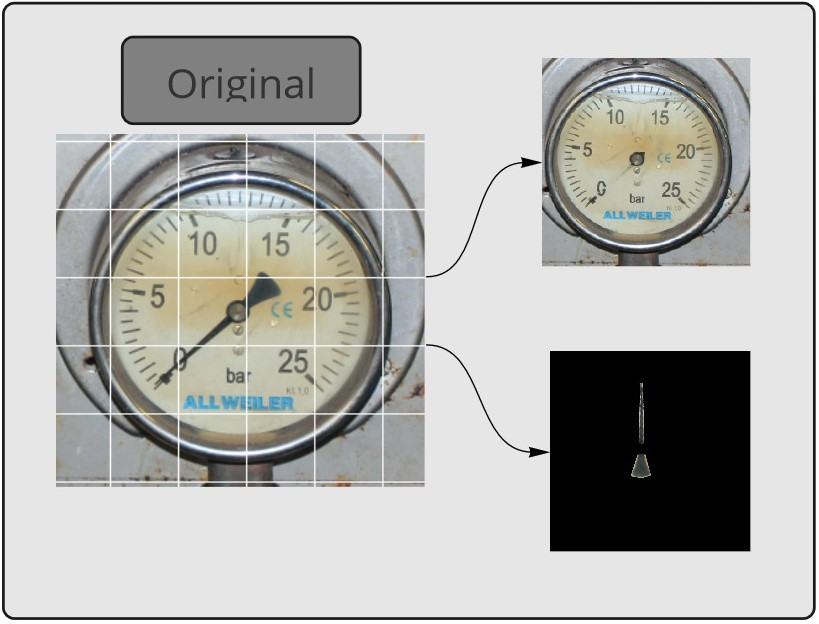
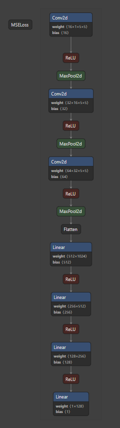

Analog Gauge Reading Using CNN Regression
=======================================

***A Deep Learning Approach for Automated Gauge Reading using CNN regression***
***
 

 


***
> **Authors:**
>
> - [Guy Dahan](https://github.com/Guydada)
>
***
> **Submission:**
>
> - Supervising company: [Captain's-Eye](https://www.captain-eye.com/)
> - Project Instructor: Mr. Doron Oizerovich
> - Project Supervisor: [Dr. Jonatan Ostrometzky](https://english.tau.ac.il/profile/jonatano)
> - Faculty: [Engineering](https://en-engineering.tau.ac.il/)
> - Department: [Digital Sciences for Hi-Tech](https://en-engineering.tau.ac.il/BSc-in-Digital-Sciences-for-Hi-Tech)
> - [Tel-Aviv University](https://english.tau.ac.il/)
>
***


# Table of Contents

1. [Requirements](#Requirements)
2. [Installation](#installation)
3. [Usage](#Usage)
4. [Demo](#Demo)
5. [Report](#Report)

___

# Full Demo Video

[](https://www.youtube.com/watch?v=Bdhece7qKJQ)
___

# Requirements

- Python 3.8
- PyTorch 1.10.2
- Torchvision 0.11.3
- Linux Ubuntu 20.04 LTS / 22.04 LTS / Windows 10 (Tested on all of them)

## Project Directory Structure

```
├───src
│   ├───calibrator
│   ├───gauges
│   ├───model
│   └───utils
├───demo
└───docs
```

- `src` - Contains the source code of the project
    - calibrator - Contains the code for the Calibrator App
    - gauges - Contains the code for the Gauges classes
    - model - Contains the code for the CNN regression model
    - utils - Contains the code for the utility functions IE mathematical functions and image processing functions
- `docs` - Documentation and an academic [poster](docs/poster_gauge_Guy_Dahan.pdf) made for the project
- `README.md` - The current document, serving as the final report for this project
- `settings.toml` - The project's local settings file. When cloned this will generate the default settings.
- `config.py` - This file will generate environment specific settings for the project, including the generation of data
  directories and their respective paths.

___

# Installation

Two ways to install the package:

- Using Anaconda
- Using poetry

Clone the repository, and run the following commands in the root directory of the repository:

## Using Poetry

```bash
poetry install
```

## Using Anaconda

```bash
conda create --name <env> --file requirements.txt
```

## Settings file

This project is designed to be a flexible project, which will support quick and easy deployment of the project
in different operating systems and scenarios. for that purpose, a settings file is created, which will generate
automatically the project's configuration. The available settings are:

| Setting                    | Default Value                | Effect                                                                                 |
|----------------------------|------------------------------|----------------------------------------------------------------------------------------|
| DEV                        | "False"                      | DEV mode - No error checking for UI                                                    |
| GAUGE_CALIBRATION_FILE_XML | gauge_params.xml'            | Name of the gauge calibration_data file                                                |
| TRAIN_IMAGE_NAME           | 'train_image.jpg'            | Name of the training image                                                             |
| NEEDLE_IMAGE_NAME          | 'needle_image.jpg'           | Name of the needle image                                                               |
| TRAIN_SET_DIR_NAME         | 'train_set'                  | Name of the training set directory                                                     |
| XML_FILE_NAME              | "camera_{}\_analog_gauge_{}" | Name of the gauge calibration_data file                                                |
| VALIDATION_SET_DIR_NAME    | 'validation_set'             | Name of the validation set directory                                                   |
| REPORT_PLT_NAME            | 'visual_test_report.png'     | Name of the report plot                                                                |
| WINDOW_SIZE                | [1500, 1500]                 | Default Calibrator app window size (width, height)                                     |
| EDIT_IMAGE_SIZE            | [500, 500]                   | Default edit image window size (pixels)                                                |
| TRAIN_IMAGE_SIZE           | 64                           | Default train image size (pixels)                                                      |
| REPORT_PLT_SIZE            | 15                           | Default report plot size (inches)                                                      |
| LOSS_THRESHOLD             | 0.002                        | Threshold for the loss function                                                        |
| BATCH_SIZE                 | 64                           | Batch size for dataset loading and training                                            |
| BATCH_MULTIPLIER           | 3                            | Batch multiplier for building the dataset                                              |
| EPOCHS                     | 150                          | Number of epochs for training                                                          |
| EPOCHS_ADD                 | 20                           | Number of epochs for additional training. Irrelevant when AUTO_ADD_EPOCHS is False.    |
| MAX_EPOCHS                 | 250                          | Maximum number of epochs for training. Irrelevant when AUTO_ADD_EPOCHS is False        |
| LEARNING_RATE              | 0.001                        | Learning rate for the model                                                            |
| AUTO_ADD_EPOCHS            | "True"                       | Automatically add epochs to the model when training if the loss is below the threshold |
| TORCH_SEED                 | 147                          | Seed for the torch random number generator                                             |
| NUM_WORKERS                | 1                            | Number of workers for dataset loading                                                  |
| DEFAULT_MODEL_TYPE         | "best"                       | Default model type for loading (best or latest)                                        |
| MODEL_VERSION              | "1.0"                        | Model version for saving                                                               |
| GAUGE_TYPES                | ['analog', 'digital']        | List of gauge types supported by the app                                               |
| TEST_REPORT_IMAGE_TILE     | 8                            | Number of images in the test report image tile                                         |

# Usage

This application has three parts:

1. *Calibration* using UI - designed to be performed quickly and once only for each gauge
2. *Training* the CNN model specifically for the gauge using the automatically generated calibration data
3. *Reading* the gauge value using the trained CNN model


# Demo

> ***NOTE:*** This project was designed completely to fit Captain's-Eye requirements, so it does not have any need for a
> native CLI
> interface. The application will give some feedback using the terminal regarding errors and progress.

To perform calibration, a sample image is needed of gauge. Through this example I would walk you through the process
of calibration, training and reading from a gauge using the code and image sample provided in the `demo` folder.

## Calibrator App

Got to `demo` directory and run:

```bash
python full_demo.py
```

The Calibrator App will open:


Click: `File` -> `Load Calibration Image`. A prompt will appear asking you to select the image. for this demo select the
demo
gauge in the `demo` folder.


The Calibrator App is intuitive and easy to use. It also includes a user error-checking system, which can be
disabled/enabled int the project's settings file using the `DEV` flag (set to `True` for no error checking).

The calibration steps show in red color on the left bar, indicating the which steps were not completed.
The order of steps is top to bottom. Completed steps are shown in green color.

| Step             | Effect                                                                      |
|------------------|-----------------------------------------------------------------------------|
| Crop             | Crop the image                                                              |
| Set Perspective  | Fix perspective issues                                                      |
| Circle Detection | Detect manually/automatically circles in the image to find the gauge center |
| Needle Detection | Using a brush, the user marks the needle for the gauge                      |
| Set Zero Angle   | Using the rotation bar, rotate to the center angle and mark it              |
| Set Min Angle    | Using the rotation bar, rotate to the minimal angle and mark it             |
| Set Max Angle    | Using the rotation bar, rotate to the max angle and mark it                 |
| Test Reading     | Test the reading from the angles                                            |

#### Crop

Simply click the `Crop` button to crop the image.


#### Set Perspective

Click the `Set Perspective` button to fix the perspective issues. Use either picking 4 points or manually tweaking
the perspective bars.


#### Circle Detection

When clicked, the app will try to automatically detect the gauge center. If it fails (visually examined by the user)
Pick the center manually.


#### Needle Detection

Set the parameters for the gauge - max reading, min reading and units. Then simply draw the needle on the image.
The size of the brush can be changed using the 'line width' slider.


#### Set Zero Angle

Rotate the gauge to the center angle and mark it. this will change slightly from gauge to gauge and is used for
calculating the reading the gauge later.


#### Set Min Angle

Rotate the gauge to the minimal angle and mark it.


#### Set Max Angle

Rotate the gauge to the max angle and mark it.


#### Test Reading

Test the reading from the angles. The reading will be displayed in the bottom bar. Visually examine the reading to
make sure the calibration is correct.


> ***NOTE:*** If reading is not correct, it usually indicates that the perspective is not correct. Try to reset and
> re-calibrate the gauge.

## Synthetic Data

Synthetic data will be created automatically for the gauge. The synthetic data is created using the calibration data and
will be split into three sets:

- Training set
- Validation set
- Test set

The default split is determined by the batch size, and the default train size is 3 times the batch size. The validation
and test sets are each at the same size as the batch size.

The synthetic data can be found in the auto-generated `data/camera_{}/gauge_{}/` folder. where the `{}` represents
indexes that are generated automatically when calibrating the gauge.

## Training, Validation and Testing

After calibration, the app will start training the model (when using the `full_demo.py` script). this can be also called
manually as follows:

```python
import src.gauges.gauge as g

calibration = g.AnalogGauge.calibrate()
analog_gauge = g.AnalogGauge(
    calibration)  # calibration is a dictionary with the calibration data. can also be loaded from a file
analog_gauge.initialize()  # start the training, validation and testing process for the gauge
```

The training process will take some time to complete. The app will display the progress in the terminal. Each epoch
will display the loss for train and validation data.

### Auto Add Epochs

The loss threshold is used to determine when to add more epochs to the model. If the loss is below the threshold. The
default is 0.002. This can be disabled or edited in the project's settings file.

### Training and Validation Report, Gauge Directory

When the training process is complete, a testing process will be performed. The testing process will test the
performance of the model on the test set and save a visual report of the results in the gauge's directory.

The gauge directory will contain the following files:

- `train` `validation` `test` - the training, validation and test sets containing the data for the model
- `gauge_net_v1.0_best.pt` - the trained model's weights specific to the gauge - best performing model
- `gauge_net_v1.0_last.pt` - the trained model's weights specific to the gauge - last epoch model
- `needle_image.png` - the needle image used for the gauge
- `train_image.png` - the image used for the training set generation
- `train_report.csv` - the training report detailing loss for each epoch of the training set
- `val_report.csv` - the validation report detailing loss for each epoch of the validation set
- `test_report.csv` - the test report detailing loss for each epoch of the test set
- `visual_test_report.png` - a visual reference of the test set results, showing the reading for different angles
- `training_plots.png` - shows the loss for each epoch of the training set and the validation set
- Additional CSV files - containing the summary for each image used in each set, it's real angle in radians and angles,
  and whether the image was augmented or not.

#### Training and Validation Report

The plot should show a converging trend for the loss. The loss should decrease as the epochs increase.


#### Test Visual Report

The plot should show the reading for each angle in the test set.


### Getting a Reading for a Calibrated Gauge

Finally, in order to get a reading for a calibrated gauge, all that is needed is the calibration's XML file.
This allows the app to recreate the preprocessing needed for the model to get its readings quicly, and uses
the trained model to get the reading.

```python
import src.gauges.gauge as g

analog_gauge = g.AnalogGauge('camera_{}_analog_gauge_{}.xml').get_reading('image.png')
```

___

# Report

In this part I will dive into the principals and ideas behind the app. This will serve as my submission final
report.

## Abstract

In order to solve the problem of realtime gauge reading, I used a neural network to predict the angle of
a needle in an analog gauge. The neural network is trained to predict the angle of a needle based on synthetic
data generated after a quick user guided calibration using a "Calibrator App". The offered CNN supplies an elegant,
easy to deploy solution that is also very flexible. This allows fast deployment in a production environment and better
results when compared to out of the box classic computer vision solutions such as OpenCV.

## Introduction

Ships are a complex system of multiple components. As years go by, less available trained personnel are available
and the level of complexity rises. In order to operate a ship today, many hours are wasted on in person approach to
reading and storing analog gauges. The app is designed to reduce this waste by automating the process.

Traditionally, CNNs are used in classification or object detection problems. I chose to use a neural network in a
regression
task for the purpose of this project. This allows me to generate a high performance model and also allows me to use
the Pytorch framework, to use GPU in order to accelerate training and much more.

At the first steps of this project, I actually researched for a solution that does not include a neural network, rather
using OpenCV and classic computer vision approach. This turned out to be a very difficult task, since the automatic
circle and contour detection were not very accurate and also demanded a very hard calibration process. I also found
a few Python 2.7 implementations using OpenCV - but when I tried to use them, they were not able to get the results
for our use case, and mostly unable to detect correctly the gauge and needles.

## Define the Problem

Main Problem:
> Get a reading from an analog gauge remotely, constantly and with minimal human presence

Secondary Problem:

> It is near impossible to generate consistent and extensive training data for an installed analog gauge

## Define the Solution

When approaching this problem, one might think that the simplest solution is to install a digital sensor near the gauge
that will upload the reading constantly. While this is very possible - it takes time, the equipment is expensive
and implementation is difficult - it is not the best solution for existing system. Furthermore, many marine companies
don't allow the owner to perform changes to the mechanical systems due to warranty and service issues.

A camera on the other hand costs ~ 100$, it's easy to install and connect. Even better - most ships already have
extensive amounts of cameras installed (CCTV).

Since that an installed gauge is impossible to dial into all the available angles, synthetic data is used to train the
model.

## Implementation

Since I have created this project for the Captain-Eye company, the framework for receiving the video feed, image frames
and storing data is already available. I had to think of a way to implement a light network that will be deployed
into the existing system.

The offered solution:

- A native calibration app
- Built in training process generating:
    - Synthetic data
    - Trained model
    - Validation and testing reports
- Built in reading process using the trained model

See below the implementation of the app structure:



## Chosen Framework and Libraries

While researching the problem, I found that the Pytorch framework is the most efficient and flexible for the problem.

## Calibrator App

The app was built entirely using Python TKinter. The app is designed to be used in a desktop environment. The app
works on both Windows and Linux. It has built in error handling. The whole calibration process takes around 2 minutes
and has top be done only once. Furthermore, the calibration can be later edited simply by editing the XML file.

I used different technics in order to make the process fast and extensible, and also implemented a few smart computer
vision techniques.

### Image manipulation

The app uses OpenCV to manipulate images. The available tools are available from within the app as a part of the
calibration
process:

- Image cropping
- Image rotation
- Perspective Transformation
- Automatic circle detection

All of the above were implemented using the OpenCV library.

In addition to that, I have implemented a way to automatically mask the needle image from the gauge image. This allows
me
to later rotate the needle image and use it to generate synthetic data.



## Synthetic Data Generation

The synthetic data is created using the following steps:


This is implemented using numpy `linspace` function.

The image writing to files is all done using OpenCV.

### Model Architecture

The main consideration for building this model was keeping it as light as possible. The model's architecture was built
using Pytorch. In order to design the CNN layers I read several articles and books and gathered the following principals
for a regression problem:

- Keeping the input image size as small as possible with good results
- Adding layers until convergence is rather fast
- Calculating the layers inputs and outputs for the chosen image size

> $\frac{\left\lceil N-f+1\ \right\rceil}{s}$

$N$ stands for the input number of dimensions (number of pixels in input image for first layer) and $f$ is the filter
size.
$s$ is the stride length. In order to calculate the next layer I simply used the equation above replacing $N$ with the
previous
layer's output size and f with the filter size. for each layer I also had to calculate the activation size, which is
simply
multiplication of the previous layer's output size and the filter size.

Where $N$ is again the input size and $f$ is the filter size for each layer.

All of the above can be found in the  file.

Using this equation I kept adding layers of Conv2D, followed by ReLU and MaxPool. Using Netron to show the structure:



### Performance Metrics

In order to calculate loss I chose to use MSE loss. The MSE loss is a good choice for regression problems. It is
implemented in Pytorch and is available in the `torch.nn` library. The loss is calculated over the projected angle in
radians vs the actual angle in radians.

The chosen optimizer is Adam. Adam is also good choice for regression problems and is implemented in Pytorch as well.

### Results

As shown on the loss graph above, the model is able to predict the angle of the needle accurately. The results are good
after around 50 epochs of training. After some trial and error, I found that a learning rate of 0.001 is a good choice
and
around 100 epochs minimize the loss quite well for different gauges.

The model was tested on ~10 different gauges and the results are all very good with accurate readings. All gauges were
tested with a train set of $64 \times 3$ images. If some gauges show poor results, it is very easy to enlarge the train
set
and tweak the learning rate or number of epochs to achieve better results.

While I was able to find a few projects dealing with reading analog gauges, I found that the best results were achieved
using my solution. I was able to find one similar implementation using Keras, but their implementation did not include
the calibration process - images had to be manually cropped and seperated into a masked gauge and
needle. [See their paper
here.](https://objectcomputing.com/resources/publications/sett/june-2019-using-machine-learning-to-read-analog-gauges)

## Conclusions and Next Steps

The main and secondary problems are solved. The solution is implemented and ready to be deployed, and actually shows
some demand within customers. The learning in this scenario is well proven to be possible, the model is light and can
actually run on CPU quite fast. the whole training process takes roughly around 3 minutes for 100 epochs on a standard
PC
with Intel i7 10th generation processor and 16 GB RAM. On a stronger AWS EC2 instance it's a matter of 0.5 minutes using
a GPU.

That said, some work can still be done. Suggested improvements regarding this implementation are:

- Include a testing framework for the code
- Upgrade to Python 3.10.4
- Improve implementation of the UI app - replace Tkinter with PyQt5
- Improve circle detection to shorten the time it takes to process the image
- Add auto unit reading
- Add object detection for the gauge itself

Furthermore, since I used an OOP approach for this whole project, I actually created the classes for a digital gauge
reader in the same manner exactly - using the same UI and same network. This might take around 3-4 additional weeks
of development to implement, but it is very much mostly straightforward from the current framework.

Additionally, I originally designed a database in order to store the reading values over SQL database. However, I found
that this is not necessary and the data will be handled by the company's backend developers.
___

# Final Notes

## Coding Standards

I have taken a big effort to try and withstand the following:

- [PEP8](https://www.python.org/dev/peps/pep-0008/)
- OOP principles
- Documentation
- Simplicity
- Minimal code duplication using inheritance and composition
- Version control is done using [Git](https://git-scm.com/).

## References

- Stevens, E., Antiga, L., & Viehmann, T. (2020).
  [Deep Learning With PyTorch](https://www.google.com/search?client=firefox-b-e&q=deep+learning+with+pytorch+). Manning
  Publications.
- [ayseceyda/analog-meter-reading-openCV](https://github.com/ayseceyda/analog-meter-reading-openCV) - OpenCV
  implementation of the
  analog meter reading app.
- [Analog Gauge Reader Using OpenCV in Python](https://www.intel.com/content/www/us/en/developer/articles/technical/analog-gauge-reader-using-opencv.html)
  -
  Intel article on how to use OpenCV to read analog gauge readings.
- [Linear regression with PyTorch](https://soham.dev/posts/linear-regression-pytorch/) - A blog post on how to use
  Pytorch to
  implement linear regression.
- [Machine Learning in Practice: Using Artificial Intelligence to Read Analog Gauges](https://objectcomputing.com/resources/publications/sett/june-2019-using-machine-learning-to-read-analog-gauges)
